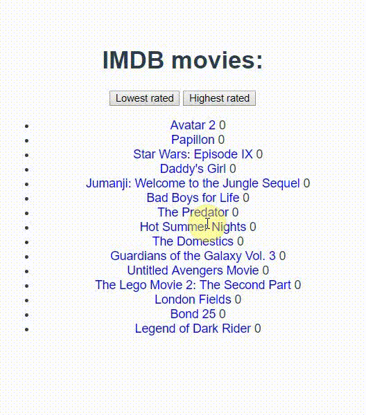

# cs-week01-movie
CoderSchool.vn - VueJs - 1st week assignment

[x] Store response to a data variable

[x] Display response results in HTML

[x] Display only first 15 results

[x] Create an API request inside mounted() function.

[x] Don't forget to use index and :key attribute when using v-for. Index can be useful for the task about displaying only 15 items in a list

[ ] For some bonus points, learn about javascript array sorting.

[x] Make list sortable by score (there are buttons for that)

[x] Can you make blue background for each movie title with score higher than 8.2?

[x] Any idea how to programmatically set a background intensity of each item, based on it's score value? (from lightest to darkest blue, based on the item's score value from 0 to 10)

[x] Create readme.md file inside your project folder and write your First name, Last name and E-mail inside.

[x] Please send your project folder (without node_modules folder!) over a dropbox, google drive or github to my email popovmomcilo@gmail.com due Sunday, 8th July, 2018, at 22:00.
